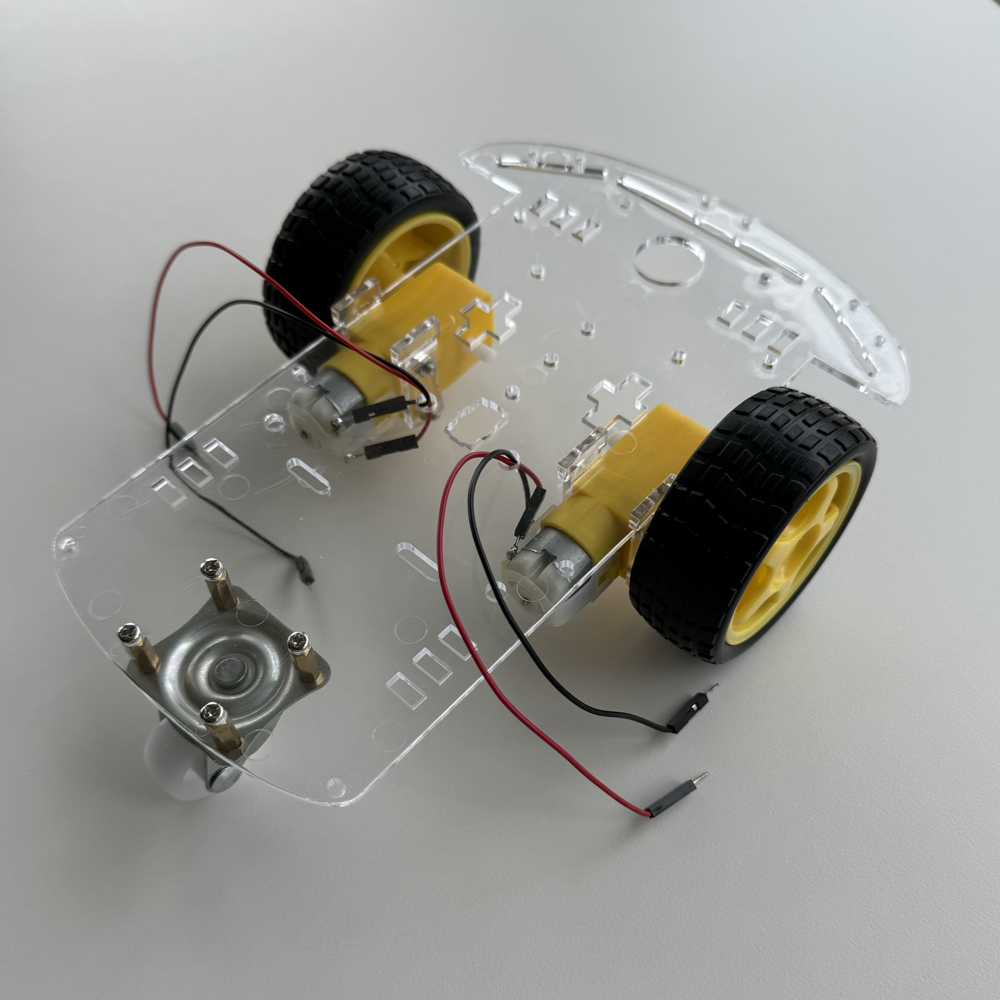
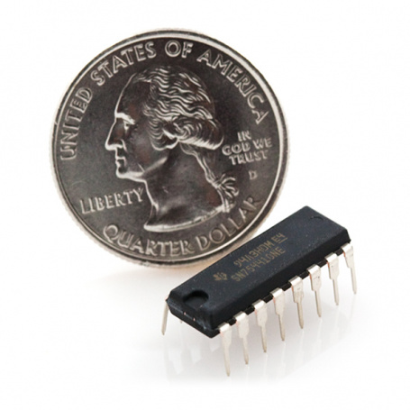

[distance_sensor]: https://www.sparkfun.com/products/15569
[h_bridge]: https://www.sparkfun.com/products/315
[jackson_innovation_studio]: https://mechse.illinois.edu/undergraduate/makerworks/jackson-innovation-studio
[rechargable_battery]: https://a.co/d/7Zmw2Af
[camera]: https://a.co/d/5NIxMsJ
[onshape_workspace]: https://cad.onshape.com/documents/69497152238ace33f89eaddf/w/5a11fc55832b67ccaf01d13f/e/4acefc6cf6d51c6a34c84319
[github_pages]: https://jameskabbes.github.io/HackIllinois2024/
[motor]: https://www.sparkfun.com/products/13302

<h1 align="center">
John Deere | HackIllinois
</h1>

<p align="center">
  
</p>

<br>

# Table of Contents

- [Prompt](#prompt)
  - [Submission Criteria](#submission-criteria)
  - [Scoring Criteria](#scoring-criteria)
  - [Integrity](#integrity)
  - [Jackson Innovation Studio](#jackson-innovation-studio)
- [Materials](#materials)
  - [John Deere Kit](#john-deere-kit)
  - [Bring your Own](#bring-your-own)
- [Raspberry Pi](#raspberry-pi)

  - [Setup Instructions](#setup-instructions)
  - [Connecting to your Raspberry Pi](#connecting-to-your-raspberry-pi)
    - [Keyboard, Mouse, Monitor](#keyboard-mouse-monitor)
    - [SSH](#ssh-command-line-access)
    - [VNC](#vnc-graphical-access)
  - [Secure Copy](#secure-copy)
  - [Find IP Address](#find-ip-address)
  - [Other Tips](#other-tips)
    - [Connecting to Wifi](#connecting-to-wifi)

- [Assembly](#assembly)
- [Wiring and Testing](#wiring-and-testing)

  - [Raspberry Pi Pin Layout](#raspberry-pi-pin-layout)
  - [Raspberry Pi HAT](#raspberry-pi-hat)

    - [H-Bridge](#h-bridge)
    - [Slide Switch - Motor Power Circuit](#slide-switch---motor-power-circuit)
    - [Button Switches](#button-switches)
    - [LEDs](#leds)

  - [Other Components](#other-components)
    - [Camera](#camera)
    - [Distance Sensors](#distance-sensors)
    - [Motor](#motor)

- [CAD Files](#cad-files)
- [Starter Code](#starter-code)
- [Computer Vision Models](#computer-vision-models)

<br>

# Prompt

<p align="center">
  <strong>Autonomous Vehicles</strong>
</p>

John Deere innovates on behalf of humanity.

It doesn’t matter if you’ve never driven a tractor, mowed a lawn, or operated a dozer. With our role in helping produce food, fiber, fuel, and infrastructure, we work for every single person on the planet.

<div style="display: flex; justify-content: center">
  <div style="display: flex; flex-direction: column; width: 75%">
    <p align="center">
      <em>
        "We don’t create tech for tech’s sake. There’s purpose behind everything we do, so that our customers have the tools they need to tackle some of the world’s greatest challenges."
      </em>
      <br><br>
      <strong>John May</strong>
      <br>
      <em>Chairman and CEO | John Deere</em>
  </div>
</div>

Along our journey of creating exceptional tools for our customers, we have become pioneers in the autonomous vehicle industry:

- [StarFire™](https://www.deere.com/en/technology-products/precision-ag-technology/): Track your equipment's location down to the inch
- [AutoTrac™](https://www.deere.com/en/technology-products/precision-ag-technology/guidance/auto-trac/): Achieve automated, hands-free guidance for your field operations, increasing efficiency and reducing operator fatigue
- [See & Spray™ Ultimate](https://www.deere.com/en/sprayers/see-spray-ultimate/): Detect weeds from plants in real time using computer vision-enabled sprayers
- [John Deere Operations Center™](https://www.deere.com/en/technology-products/precision-ag-technology/operations-center/): Setup, manager, and monitor critical jobs on your farm from anywhere in the world
- [Machine Sync](https://www.deere.com/en/technology-products/precision-ag-technology/guidance/machine-sync/): Connected machines working simultaneously for maximum productivity in the field
- [Autonomous 8R Tractor](https://www.youtube.com/watch?v=QvFoRk4JsPc): Designed to autonomously perform various agricultural tasks while maintaining precision and productivity

<br>
Now, let's see what you can build.

<br>
<br>

<p align="center">
  <strong>Build your own autonomous vehicle</strong>
</p>

<br>

For your HackIllinois 2024 John Deere prompt, <strong>you are tasked with building your own autonomous vehicle, a vehicle that solves any problem that you define.</strong>

It is up to each team to determine what _problem_ your vehicle solves. Does it drive down the road? Deliver food? Solve a maze? Plant a corn field? It could be something useful, something fun, or anything you can imagine. The only stipulation is that your vehicle:

- Solves the problem autonomously, that is, makes decisions on its own
- Uses data from sensor(s) in its decisions

Each team is supplied with a [hardware kit](#john-deere-kit). Teams are welcome to add to the vehicle and kit as needed. Teams are not required to use all items in the kit.

Like many problems at John Deere, this prompt requires more than just a software solution, it requires a solution at the intersection of mechanical systems, electrical systems, sensors, data, automation, programming, and of course, creativity.

Good luck!

## Submission Criteria

We expect to see the following as part of submissions:

- Devpost writeup
  - Codebase
  - Problem description
  - Solution explanation
- Video of the vehicle working

## Scoring Criteria

Submissions will be assessed by the following criteria:

- **Problem Complexity**: how complex is your problem?
- **Solution Creativity**: how creative is your solution?
- **Functionality**: how successfully does your vehicle solve your defined problem autonomously?

## Integrity

You are encouraged to use any open source and AI tools you wish. Be sure to mention sources of inspiration in your project write-up.

## [Jackson Innovation Studio][jackson_innovation_studio]

We have parterned with the [Jackson Innovation Studio][jackson_innovation_studio] on campus to give you access to any tools you might need. The studio provides access to 3D printers, multimeters, screwdrivers, tape, and anything else you might need.

### Private Office Hours

We have reserved the Jackson Innovation Studio for participants in the John Deere track. The space will be available to participants at the following times:

- Friday, February 23 8:30pm - 11:00pm
- Saturday, February 24 12:00pm - 5:00pm

The Jackson Innovation Studio is located in the basement of the Sidney Lu Mechanical Engineering Building at [1206 W Green St, Urbana, IL 61801, Room 0100](https://maps.app.goo.gl/Gp97vbMnAPboCCGY8)

<br>

# Materials

## John Deere Kit

John Deere provides the following items:

- Vehicle Chassis

  - 2 Rubber wheels
  - 2 Speed encoders
  - Swivel wheel and connectors
  - Acryllic frame
  - 3D Printed battery frame

- Raspberry Pi

  - [Raspberry Pi 4 Model B 4GB RAM](https://www.raspberrypi.com/products/raspberry-pi-4-model-b/)
  - 64 GB Micro SDXC Card
  - Ethernet Cable
  - USB-C to Ethernet Adapter

- Power

  - [10,000mAh Rechargeable Battery][rechargable_battery]
  - USB-C to USB-C: for powering Raspberry Pi / recharing battery
  - USB-A to Micro USB: for powering Raspberry Pi HAT / motors

- Electronics

  - Printed Circuit Board

    - 2 Button Switches - to be read by Raspberry Pi
    - Slide Switch - to control motor power circuit
    - 2 LEDs
    - [H-Bridge][h_bridge]

  - [Camera][camera]
  - 2 [Ultrasonic Distance Sensors][distance_sensor]
  - 2 [Electric Motors][motor]

## Bring your Own

We assume your team can supply the following items:

- A laptop with a USB-C port
- A USB-C charging brick

<br>

# Raspberry Pi

A tiny computer in the palm of your hand. [raspberrypi.com](https://www.raspberrypi.com/)

## Setup Instructions

Follow along for the recommended setup instructions

- power on your raspberry pi
- connect raspberry pi to your computer via ethernet cable
- ssh into raspberry pi on your computer
- If you want graphical access (to see a screen) follow along below
  - get raspberry pi onto the same internet network as your computer
  - find IP address of raspberry pi
  - establish a VNC connection to raspberry pi

## Connecting to your Raspberry Pi

There are few ways to access your raspberry pi:

1. Keyboard, Mouse, Monitor
2. SSH (from another computer)
3. VNC (from another computer)

### Keyboard, Mouse, Monitor

You can use a raspberry pi like any other computer. Connect a keyboard and mouse via usb (or bluetooth) and connect a monitor to the Mini HDMI port.

### [SSH](https://en.wikipedia.org/wiki/Secure_Shell) (Command Line Access)

You can establish an ssh connection for access to the raspberry pi terminal.

**1a. With direct ethernet connection**

- `ssh <username>@<hostname>.local`
- `ssh pi@hackilpi1.local`

**1b. While on same network**

- `ssh <username>@<ip_address>`
- `ssh pi@10.0.0.35`

**2. Enter your password**

### VNC (Graphical Access)

You can establish a VNC connection for graphical access to the raspberry pi.

**1. Download a VNC Viewer**

Something like [RealVNC Viewer](https://www.realvnc.com/en/connect/download/combined/)

<p align="center">
  
</p>

**2. Connect to Network**

Ensure your raspberry pi and computer are connected to the same internet network. See [connecting to wifi](#connecting-to-wifi) below.

**3. Establish Connection**

Enter your raspberry pi's ip address and establish a connection

<p align="center">
  
</p>

**4. Enter your password**

_note_: you may need to [enable VNC access](https://raspberrypi-guide.github.io/networking/connecting-via-VNC#enable-vnc-on-the-raspberry-pi) on your raspberry pi

**5. Control the Raspberry Pi**

Use the window on your computer to access your Raspberry Pi's OS.

## Secure Copy

Secure Copy, `scp`, allows you to transfer files between two locations, using the [SSH](#ssh-command-line-access) protocol. Check out [`copy_repo_to_pi.sh`](copy_repo_to_pi.sh) for an example.

## Find IP Address

To find the IP address of your raspberry pi, run

`ifconfig`

Look for `inet`.

## Other Tips

### Connecting to Wifi

You may wish to connect to your raspberry pi without a direct ethernet connection. Follow along for instructions on connecting to a network.

**1. Edit the `wpa_supplicant.conf` file**

`sudo nano /etc/wpa_supplicant/wpa_supplicant.conf`

**2. Add your network**

Add the following lines to the file, substituing your network's SSID and password

```
network={
    ssid="your_SSID"
    psk="your_password"
}
```

**3. Restart the networking service**

`sudo systemctl restart networking`

<br>

# Assembly

## Assemble Car Chassis

Follow the provided instructions to assemble the car chassis. The following items from the chassis kit are not used:

- AA Battery Pack
- Speed Encoders
- Switch

<p align="center">
  
</p>

## Attach Battery Holder

Attach the provided 3D print to the chassis. Use the remaining screws and nuts to fasten to the arcyllic frame.

<p align="center">
  
</p>

## Check Battery Fit

Ensure the battery fits properly into the frame.

<p align="center">
  
</p>

<br>

# [Wiring](<static/Raspberry Pi Hat Wiring Diagram.pdf>)

Follow along with the [wiring schematic](<static/Raspberry Pi Hat Wiring Diagram.pdf>) for instructions on how to wire your vehicle.

  <p align="center">
    
  </p>
  <p align="center">
    <em>A fully wired vehicle</em>
  </p>

## Raspberry Pi Pin Layout

To power on the Raspberry Pi, attach the USB-C cable.

<a href="https://www.raspberrypi.com/documentation/computers/raspberry-pi.html">
  <p align="center">
    
  </p>
</a>

## Raspberry Pi HAT

To simplify the wiring process, a Raspberry Pi HAT is provided for you. The HAT is placed directly on top of the Raspberry Pi. In the schematic, square pins designate `Pin 1`. To power on the circuit board, attach the micro USB cable.

<p align="center">
  
    
</p>

### [H-Bridge][h_bridge]

<p align="center">
  
</p>

**Ensure proper H-Bridge orientation by checking that the notch on the H-Bridge matches the notch on the board.**

Each side (motor) of the H-Bridge takes in three inputs sent by the raspberry pi:

- speed (pwm signal)
- control 1 (binary signal)
- control 2 (binary signal)

The **direction** of the motor is controlled by sending high (3.3V) or low (0V) voltage to controls 1 and 2.

| Control 1 | Control 2 | Motor Direction |
| --------- | --------- | --------------- |
| HIGH      | HIGH      | n/a             |
| HIGH      | LOW       | Forward         |
| LOW       | HIGH      | Backward        |
| LOW       | LOW       | n/a             |

The **speed** of the given motor is determined by the [duty cycle](https://en.wikipedia.org/wiki/Duty_cycle) of the [PWM signal](https://en.wikipedia.org/wiki/Pulse-width_modulation). A duty cycle of 100% turns the motor at 100% speed, a duty cycle of 50% turns the motor at 50% speed. Read the source code for examples.

### Slide Switch - Motor Power Circuit

A slide switch is already assembled for you. Located next to the micro USB port, this switch controls the **motor power circuit**.

It has two states:

- **on**: slid _away_ from the micro USB port - current flows to motors
- **off**: slid _toward_ to the micro USB port - current does not flow to motors

### Button Switches

Labeled `Switch 1` and `Switch 2` on the board, these button switches signal to the Raspberry Pi whether they are currently being pressed. The `state` of the switch can be tracked with software.

### LEDs

Two LEDs are provided for you on the board. They are controlled by the Raspberry Pi.

## Other Components

You are required to wire the following components to your vehicle. To insert wires into the green terminal blocks, push down on the top, insert the wire, and release. Test your connecting by gently pulling on the connected wire.

### [Camera][camera]

Follow along with [this video](https://www.youtube.com/watch?v=GImeVqHQzsE) to install your camera.

Other helpful camera resources:

- https://datasheets.raspberrypi.com/camera/picamera2-manual.pdf
- https://www.raspberrypi.com/documentation/computers/camera_software.html#python-bindings-for-libcamera

### [Distance Sensor][distance_sensor]

Connect the pins of each ultrasonic distance sensor in their appropriate appropriate locations. You will need to remove the plastic caps from the jumper wires before inserting into the green terminal blocks.

### [Motor][motor]

Connect each motor's positive and negative terminals at the assigned pins. If your motor turns in the opposite direction you expect, swap the polarity by switching the wires.

**Motor not turning?**

Make sure your [motor power slide switch](#slide-switch-motor-power-circuit) is on.

**Still not turning?**

You may have blown a fuse in the motor circuit. Reach out for help.

# [CAD Files][onshape_workspace]

This repository contains CAD files for various aspects of the assembled vehicle in the [`cad_files`](cad_files) directory. These files are provided for your benefit. They may come in handy for additional components you design. Additionally, an [Onshape workspace](onspace_workspace) is provided.

<p align="center">
  
</p>

<br>

# [Starter Code][github_pages]

This repository contains basic starter code for you in Python in the [`code`](code) directory. The Raspberry Pi comes installed with `Python 3.11.2`. Documentation is hosted on the repo's [GitHub Pages][github_pages].

## Testing

After wiring each system, test its functionality with the appropriate `test_<system>.py` script.

<br>

# Computer Vision Models

Teams utilizing the camera for their autonomous vehicle might find it helpful to use open-source computer vision models. It is recommended to look up Raspberry Pi-specific install instructions for your chosen library.

## Popular Libraries

- OpenCV
  - Raspberry Pi installation: `sudo apt-get install python3-opencv`
- TensorFLow
- PyTorch
- Keras

# Need Project Inspiration?

John Deere hosts dozens of publically available APIs and demo data. Create a MyJohnDeere account and get started! Read more at [developer.deere.com](https://developer.deere.com).

# Author Notes

I hope you enjoy your HackIllinois experience! I really enjoyed designing this prompt for you all. Best of luck!

James Kabbes | John Deere
